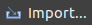
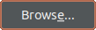
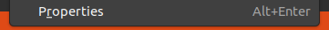
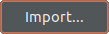
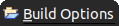
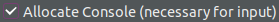

# CacheBuilder [](https://github.com/kryptonbutterfly/CacheBuilder/actions/workflows/maven-publish.yml)

ByteCode manipulator used to decorate methods using **[@Cache](https://github.com/kryptonbutterfly/tinyCache)** annotations.

## Getting the latest release

```xml
<repository>
  <id>github</id>
  <url>https://maven.pkg.github.com/kryptonbutterfly/maven-repo</url>
</repository>
```
```xml
<dependency>
  <groupId>de.tinycodecrank</groupId>
  <artifactId>cache_builder</artifactId>
  <version>1.1.0</version>
</dependency>
```

## Download

java version | library version | Download
:----------: | :-------------: | :-------
18+          | 1.1.0           | [CacheBuilder.zip](https://github.com/kryptonbutterfly/CacheBuilder/releases/download/v1.1.0/CacheBuilder.zip)</br>[CacheBuilder.tar.gz](https://github.com/kryptonbutterfly/CacheBuilder/releases/download/v1.1.0/CacheBuilder.tar.gz)
18+          | 1.0.0           | [CacheASM.zip](https://github.com/kryptonbutterfly/CacheBuilder/releases/download/v1.0.0/CacheASM.zip)

## Install

extract **CacheASM.zip** in your <span style="color:#00aaee">**eclipse install directory**</span>.


## Project Setup

### Import launch config into workspace

- click 
- click 
- select 
- click 
- click 
- navigate to <span style="color:#00aaee">**eclipse install directory**</span>**/builder/launch-configs**
  </br>
- click 
- highlight **launch-config** select **Cache.launch**
  </br>
- click 

### Setup launch config as project builder
- right click your project
- select 
- select 
- click 
- select 
- click 
- click 
- open the Tab 
- select the **CheckBoxes**:
    - 
    - 
    - 
    - 
- click 
- click 
- click 
